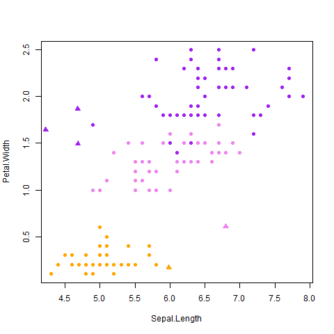
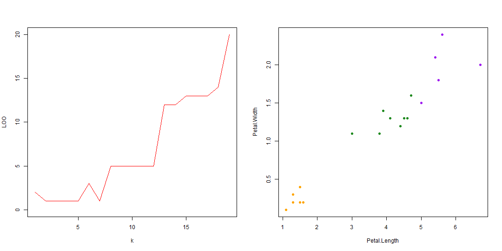
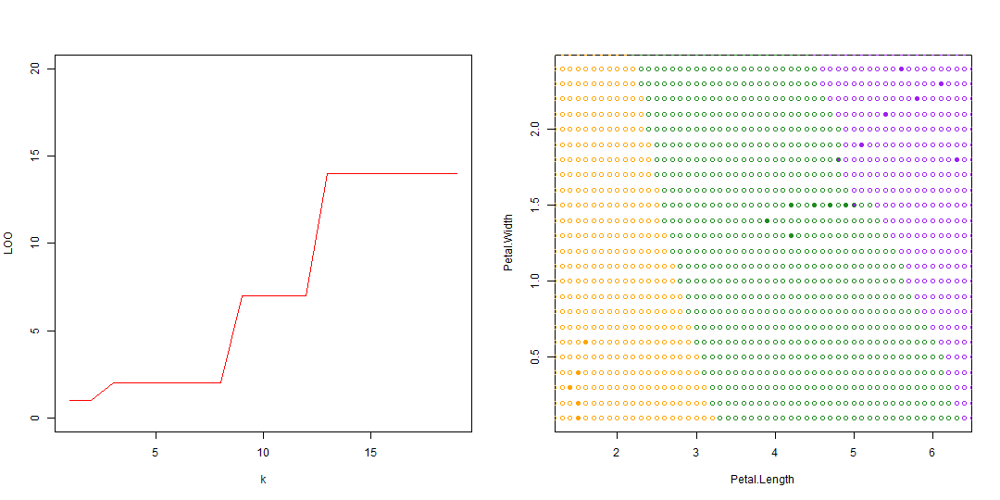
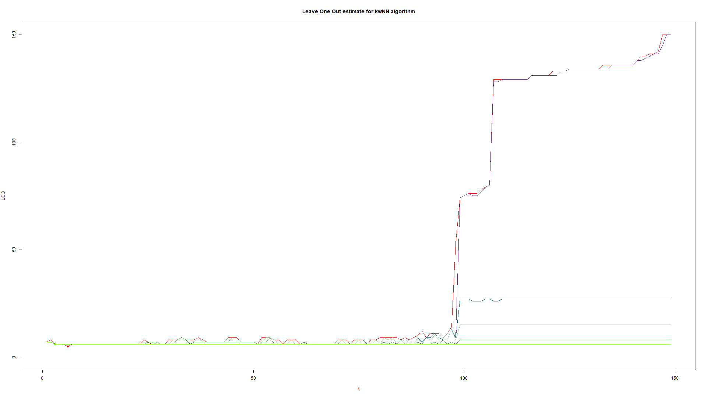
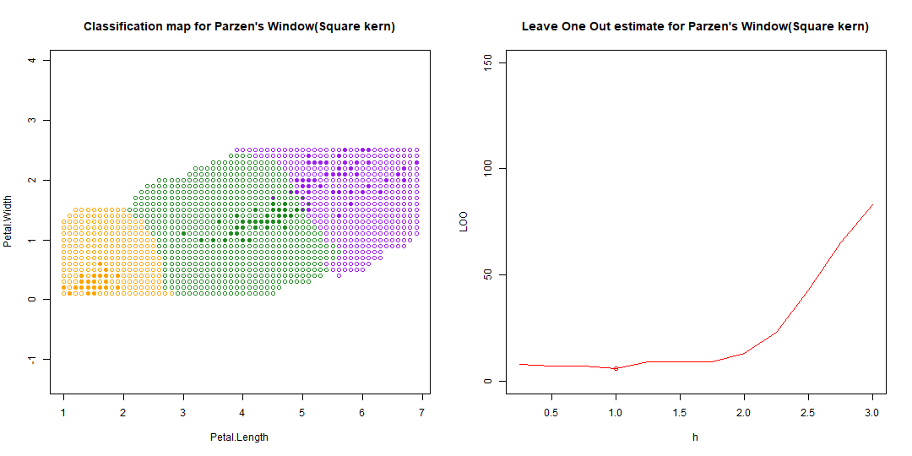
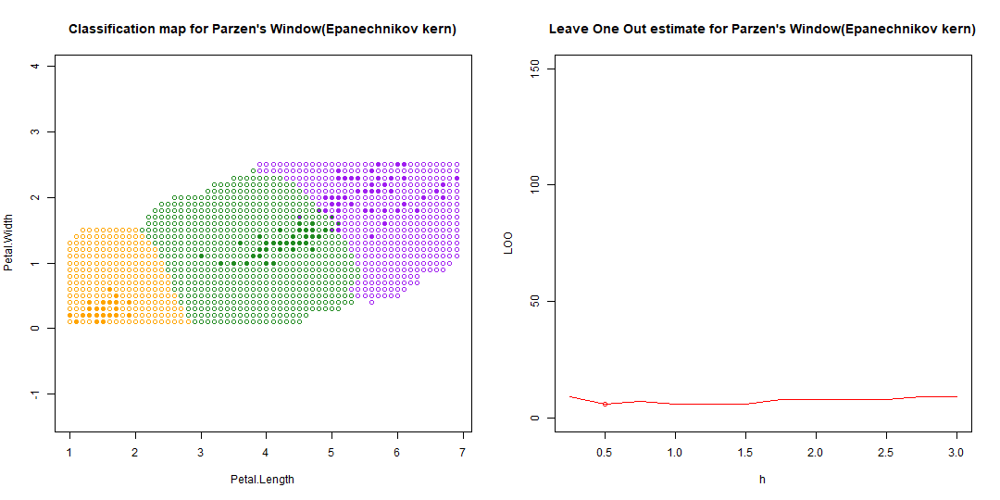
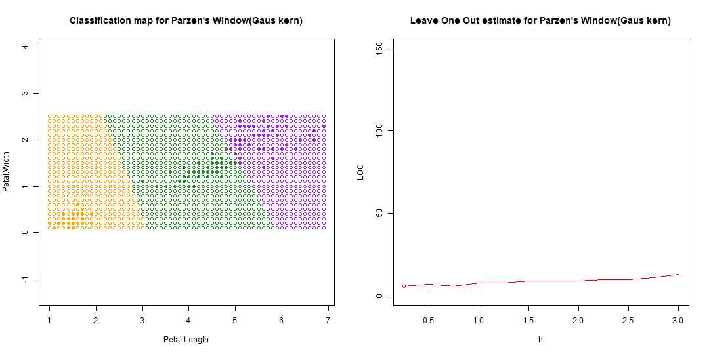

**Задача классификации**
Пусть дано множество объектов(выборка), разделеных некоторым образом на классы. Дан объект, класс которого неопределен. Задача классификации заключается в определении класса для этого обьекта на основе выборки.

Метрические Алгоритмы
============================
kNN
-----------------------------
Алгоритм находит ближайшие k обучающих объектов относительно искомого и классифицирует его, исходя из частоты встретившихся классов из этих объектов.




```R
#dat - данные в формате: список векторов типа [ x1, x2, ... , xn, class]
#где x1, ..., xn - координаты екземпляра
#p - данные в формате: [ x1, x2, ... , xn]
#по умолчанию k=1
kNN <- function(dat, point, k = 1)
{
    ##  Сортируем выборку согласно классифицируемого объекта
    orderedDat <- dist_sort(dat, point)
    n <- dim(orderedDat)[2] - 1
    ##  Получаем классы первых k соседей
    classes <- orderedDat[1:k, n + 1]
    ##  Составляем таблицу встречаемости каждого класса
    counts <- table(classes)
    ##  Находим класс, который доминирует среди первых k соседей
    class <- names(which.max(counts))
    return (class)
}
```



kwNN
-----------------------------------
~~КВН~~

Алгоритм работает подобно алгоритму kNN, но для определения класса искомой точки использует не наиболее встречающийся класс из k ближайших точек, а считает сумму весов из ближайших обучающих точек для каждого класса. По наибольшей сумме весов определяется класс точки.

```R
#dat - данные в формате: список векторов типа [ x1, x2, ... , xn, class]
#где x1, ..., xn - координаты екземпляра
#point - данные в формате: [ x1, x2, ... , xn]
#по умолчанию k=1
kwNN <- function(dat, point, k = 1)
{
    #в качестве функции весов берем убывающую неотрицательную e^(-x/l)
    w <- exp(-1:-k)

    #сортируем по расстоянию
    orderedDat <- dist_sort(dat, point, dist_func)
    n <- dim(orderedDat)[2] - 1

    #создаем счетчик весов для классов
    classes = rep(0, length(levels(orderedDat[, n+1])))

    #прибавляем веса к счетчику, исходя из ближайших найденных классов
    for(i in 1:k){
        classes[orderedDat[i, n+1]] + w[i]
    }

    #определяем максимальный счетчик и привязанный к нему класс
    class <- levels(orderedDat[, n+1])[which.max(classes)]

    return (class)
}
```


Заключение
-----------------------
kNN и kwNN довольно простые в реализации алгоритмы, но имеют довольно большое время выполнения.
Исходя из скользящих оценок, алгоритмы kNN и kwNN теряют свою надежность по мере возрастания k. Оптимальные k:

Таблица для kwNN, w = {x: x=q^i, 0<q<1, i for (1,k)}:

| q-параметр для W | Оптимальный k | Погрешность |
|:----------------:| -------------:| -----------:|
| 1.0              | 6             | 5/150       |
| 0.9999           | 3             | 6/150       |
| 0.9994           | 3             | 6/150       |
| 0.999            | 3             | 6/150       |
| 0.99             | 3             | 6/150       |
| 0.9              | 3             | 6/150       |



Парзеновское окно
------------------------
Алгоритм похож принципом работы на kwNN, только k будет равнятся длине всей выборки, а весовая функция будет считатся в зависимости от растояния.
Сама весовую функция будем называть ядром. Ядро должно быть четной невозврасающей функцией на промежутке [0,+8)

Существует 5 классических ядер для этого метода:
- Квадратное: y = 0.5 if |x| < 1 else 0
- Треугольное: y = 1-x if |x| < 1 else 0
- Квадратическое: y = (15/16) * (1-x^2)^2 if |x| < 1 else 0
- Епаничникова: y = (3/4) * (1-x^2) if |x| < 1 else 0
- Гауса: y = 1/sqrt( 2*PI*e^(x^2) )

Все выше перечисленные ядра обладают одним свойством: их площадь равна еденице. В будущем это позволит рассматривать алгоритм как Баесовский.

Код алгоритма:
```R
#dat - данные в формате: список векторов типа [ x1, x2, ... , xn, class]
#где x1, ..., xn - координаты екземпляра
#x - данные в формате: [ x1, x2, ... , xn]
#h - ширина окна double
#kernel - функция ядра

parzenWind <- function(x, select, h=1, kernel = SqrKernel, dist_func = euclid_distance){

    #получаем размеры выборки
    l <- dim(select)[1]
    n <- dim(select)[2] - 1

    #создаем счетик для классов
    classes = rep(0, length(levels(select[, n+1])))

    #проходимся по выборке считаем дистанцию и ядро
    for(i in 1:l) {
        tmp_sel = select[i,1:(n+1)]
        classes[tmp_sel[,n+1]] <- classes[tmp_sel[, n+1]] + kernel(dist_func(tmp_sel[, 1:n], x) / h)
    }

    # проверяем, что хоть один класс попал в окно
    if (max(classes) != 0 ) {
      # возвращаем имя класса, у которого максимальное кол-во "голосов"
      return(levels(select[, n+1])[which.max(classes)])

    }

    # Если никакой класс не попал в окно, возвращаем альтернативный класс
    return(0)
}
```

Ниже представленны карты классификаций и скользящие оценки по ширине окна для разных ядер:






Ниже представлена сравнительная таблица для разных ядер

| Ядро           | Оптимальный h | Погрешность |
|:--------------:| -------------:| -----------:|
| Квадратное     | 1             | 6/150       |
| треугольное    | 0.5           | 6/150       |
| Квадратическое | 0.5           | 6/150       |
| Епаничникова   | 0.5           | 6/150       |
| Гаусовское     | 0.25          | 6/150       |
