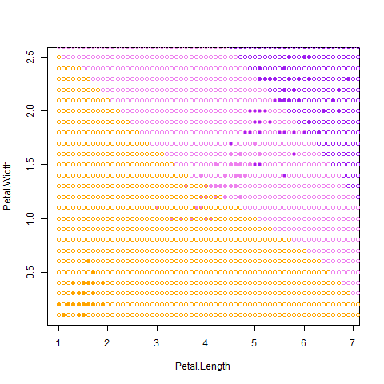
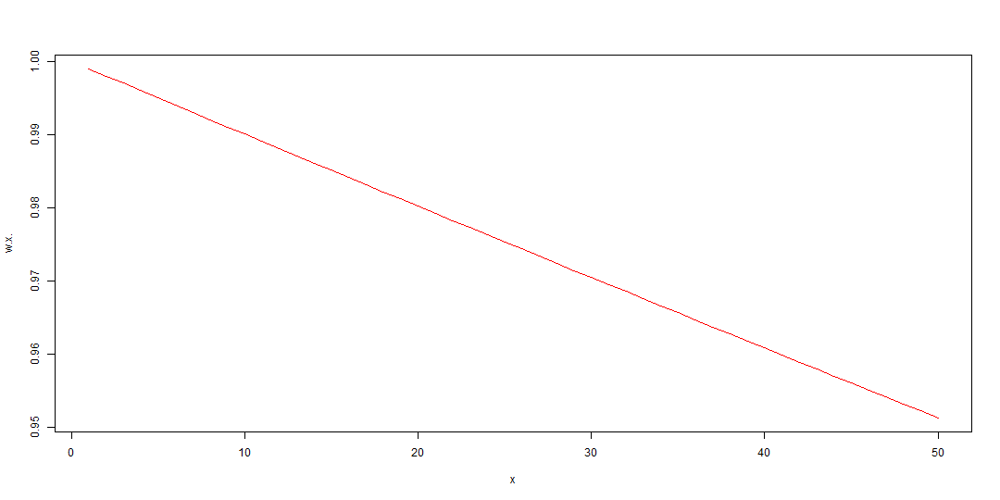

# ml1
Пусть дано множество объектов(выборка), разделеных некоторым образом на классы. Дан объект, класс которого неопределен. Задача классификации заключается в определении класса для этого обьекта на основе выборки.

kNN
-----------------------------
Алгоритм находит ближайшие k обучающих объектов относительно искомого и классифицирует его, исходя из частоты встретившихся классов из этих объектов.




```R
#dat - данные в формате: список векторов типа [ x1, x2, ... , xn, class]
#где x1, ..., xn - координаты екземпляра
#p - данные в формате: [ x1, x2, ... , xn]
#по умолчанию k=1
kNN <- function(dat, point, k = 1)
{
    ##  Сортируем выборку согласно классифицируемого объекта
    orderedDat <- dist_sort(dat, point)
    n <- dim(orderedDat)[2] - 1
    ##  Получаем классы первых k соседей
    classes <- orderedDat[1:k, n + 1]
    ##  Составляем таблицу встречаемости каждого класса
    counts <- table(classes)
    ##  Находим класс, который доминирует среди первых k соседей
    class <- names(which.max(counts))
    return (class)
}
```


kwNN
-----------------------------------
~~КВН~~

Алгоритм работает подобно алгоритму kNN, но для определения класса искомой точки использует не наиболее встречающийся класс из k ближайших точек, а считает сумму весов из ближайших обучающих точек для каждого класса. По наибольшей сумме весов определяется класс точки.

Пример функции весов e^(-x/l)


```R
#dat - данные в формате: список векторов типа [ x1, x2, ... , xn, class]
#где x1, ..., xn - координаты екземпляра
#point - данные в формате: [ x1, x2, ... , xn]
#по умолчанию k=1
kwNN <- function(dat, point, k = 1)
{
    #в качестве функции весов берем убывающую неотрицательную e^(-x/l)
    w <- exp(-1:-k)

    #сортируем по расстоянию
    orderedDat <- dist_sort(dat, point, dist_func)
    n <- dim(orderedDat)[2] - 1

    #создаем счетчик весов для классов
    classes = rep(0, length(levels(orderedDat[, n+1])))

    #прибавляем веса к счетчику, исходя из ближайших найденных классов
    for(i in 1:k){
        classes[orderedDat[i, n+1]] + w[i]
    }

    #определяем максимальный счетчик и привязанный к нему класс
    class <- levels(orderedDat[, n+1])[which.max(classes)]

    return (class)
}
```


Заключение
-----------------------
kNN и kwNN довольно простые в реализации алгоритмы, но имеют довольно большое время выполнения.
Исходя из скользящих оценок, алгоритмы kNN и kwNN теряют свою надежность по мере возрастания k. Оптимальные k:
для kNN - 3
для kwNN - 1
