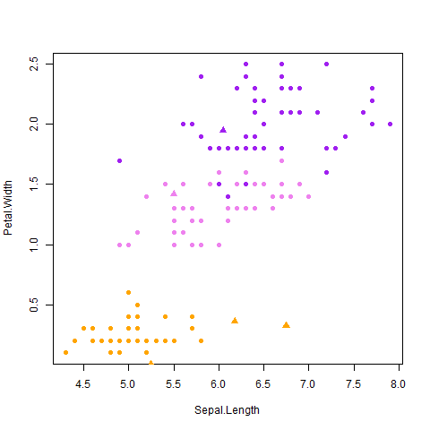

# ml1
Machine learning 1 крч)))0)0))
====================
kNN
-----------------------------
Алгоритм находит ближайшие k классифицированных точек до неизвестной точки и по наичастейшему встречающемуся классе классифицирует точку.



> Спортивная классика:

```R
kNN <- function(dat, point, k = 1)
{
    ##  Сортируем выборку согласно классифицируемого объекта
    orderedDat <- dist_sort(dat, point)
    n <- dim(orderedDat)[2] - 1
    ##  Получаем классы первых k соседей
    classes <- orderedDat[1:k, n + 1]
    ##  Составляем таблицу встречаемости каждого класса
    counts <- table(classes)
    ##  Находим класс, который доминирует среди первых k соседей
    class <- names(which.max(counts))
    return (class)
}
```

Скользящая оценка алгоритма.

