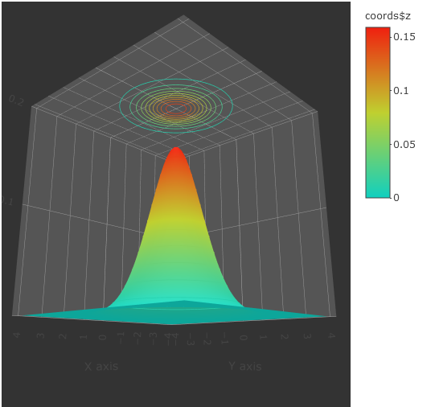
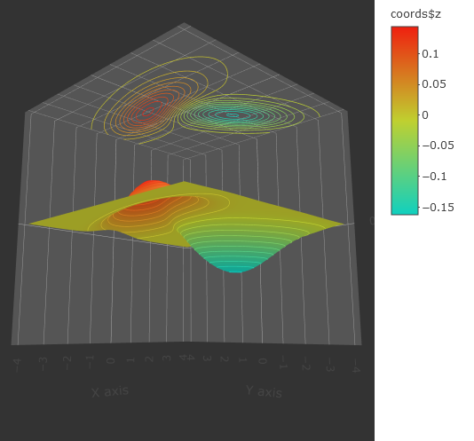

# Баесовский Классификатор

**Баесовский классификатор** - класс алгоритмов, основаных на принципе выбора по максимальной апостериорной вероятности, тоесть по вероятности зависящей от условий. Является самым оптимальным аналитическим классификатором, если известны плотности распределения классов.

И всё бы было хорошо, только есть проблема. Мы не всегда имеем эти плотности распределения, и их приходится восстанавливать с погрешностями с помощью алгоритмов.

### Линии уровня для баесовского классификатора на основе нормального распределения.

Проиллюстрируем линии уровня для нормального распределения, имитирующего некий идеальный класс.

Величина рапределения в точке **x** считается по формуле:

`ND(x, u, M) = e^(-0.5 * (x - u)T * ~M * (x - u)) / sqrt((2 * pi)^k * |M|)`,

где **x** - наша искомая точка размерности **k**, **u** - точка центра распределения размерности **k**, **M** - ковариационная матрица, **~M** - обратная матрица, **(V)T** - транспонированый вектор **V**;

#### Граффик плотности одного класса с линиями уровня

```
u = (0, 0)
M = [[1, 0], [0, 1]]
```



["Интерактивный граффик, щелкните!"](http://htmlpreview.github.io/?https://github.com/dashedman/ml1/blob/master/bayes/contour.html)

#### Граффик плотности двух классов с линиями уровня

_Note:_ *Граница классов будет проходить по контуру на нулевой высоте!*
```
u1 = (0.8, -1)
M1 = [[2, 1], [0, 0.5]]
u2 = (-1, 1.5)
M2 = [[0.8, 0], [-1, 1.2]]
```



["Интерактивный граффик, щелкните!"](http://htmlpreview.github.io/?https://github.com/dashedman/ml1/blob/master/bayes/contour2.html)

## Баесовские алгоритмы

Рассмотреные ниже алгоритмы, так или иначе, находят именно **плотность распределения** класса на основе обучающей выборки.

#### Наивный баес
