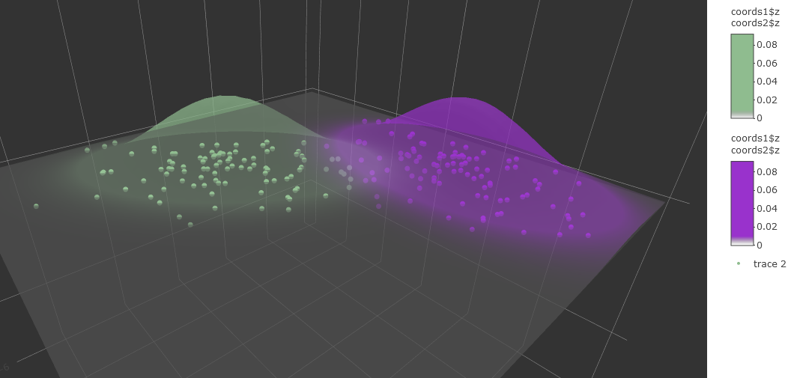
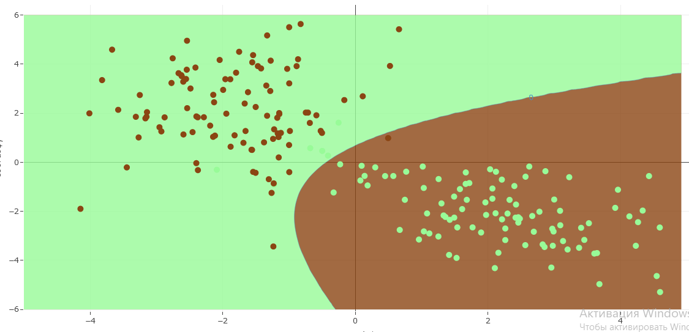
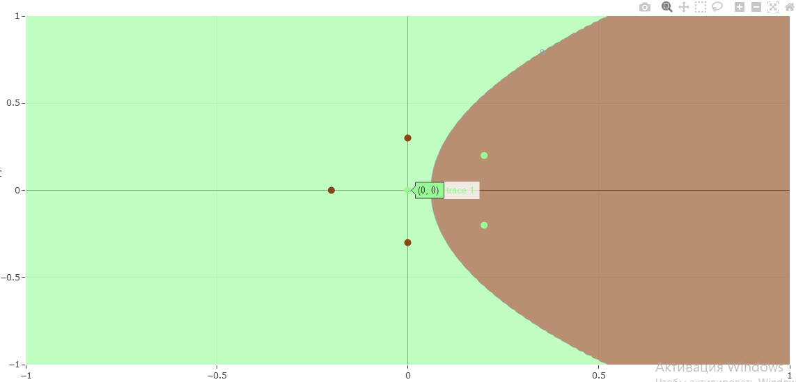
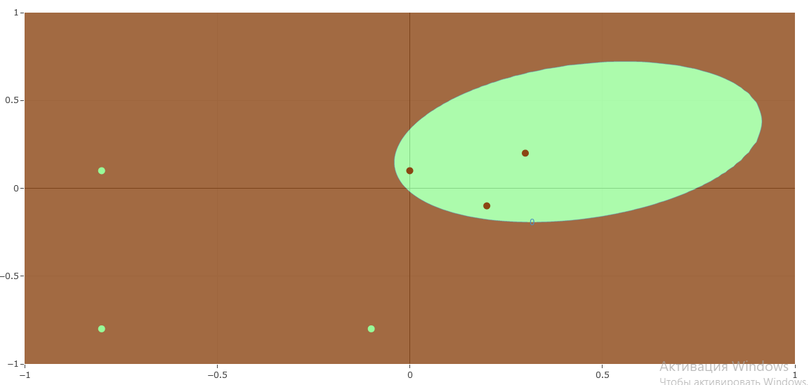
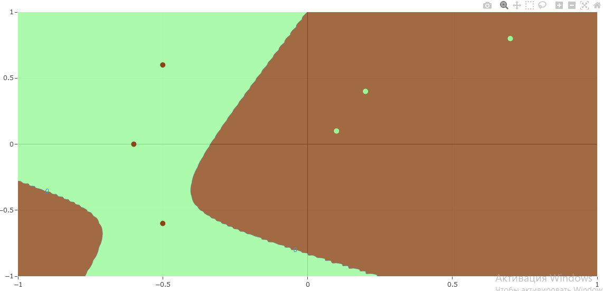
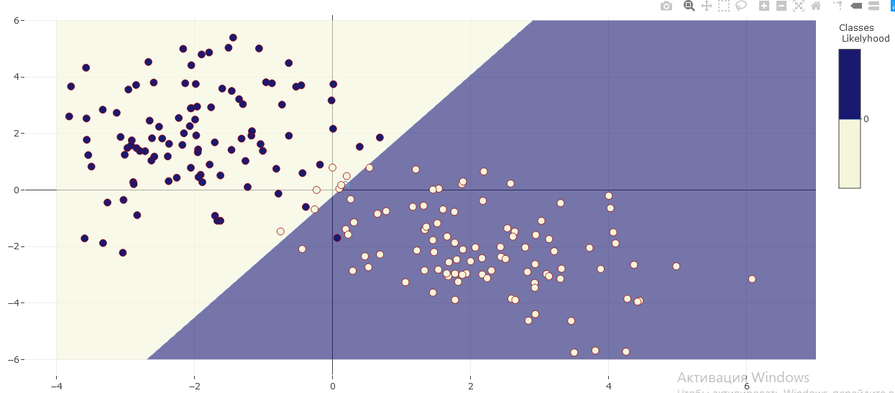

# Баесовский Классификатор

**Баесовский классификатор** - класс алгоритмов, основаных на принципе выбора по максимальной апостериорной вероятности, тоесть по вероятности зависящей от условий. Является самым оптимальным аналитическим классификатором, если известны плотности распределения классов.

Формула определения класса(Баесовское правило):
`a(x) = argmax(y){λ_y * P(y|x)}`

Понять её можно так: обьект **x** принадлежит к классу **y** такому, у которого величина потери **λ_y** помноженая на функцию правдоподобия **P(y|x)** максимальна, среди всех остальных классов.
В свое время, функцию правдоподобия **P(y|x)** можно понять как, вероятность того насколько наш объект **x** мог быть выбран из этого класса **y**. Иными словами, насколько правдоподобно(похоже на правду) что, **x** находится в классе **y**.
В любом случае, не исключен шанс того что, мы промахнемся в своей догадке и определим класс неверно. Если наше неверное определение к классу **y** очень опасно и недопустимо, искусственно уменьшим итоговое значение функции правдоподобия, домножив на штрафной коэффициент **λ_y**. Таким образом, шанс отнести обьект к классу **y** ниже, и следственно шанс сильно ошибится тоже - ниже.

**Замечание.** Работая с вероятностями мы чаще всего работаем с числами в [0; 1]. Всячески их умножаем и так далее. Из за этого числа быстро сходятся к **нулю**. Для удобства, взяв **логарифм** от наших вероятностей получим число в промежутке [-inf; 0]. В итоге с таким более развернутым промежутком проще работать и нам, и компьютеру. Плюсом будет так же то, что любое умножение при логарифмировании превращается в сложение, что проще.
Логарифмируем нашу главную формулу:

`a(x) = argmax(y){ log(λ_y) + log(P(y|x))}`,

И всё бы было хорошо, только есть проблема. Мы очень редко имеем на руках требуемую функцию правдоподобия, и её приходится восстанавливать с погрешностями с помощью разных алгоритмов.

## Линии уровня для баесовского классификатора на основе нормального распределения.

Проиллюстрируем линии уровня для нормального распределения, имитирующего некий идеальный класс.

Величина рапределения в точке **x** считается по формуле:

`ND(x, u, M) = e^(-0.5 * (x - u)T * ~M * (x - u)) / sqrt((2 * pi)^k * |M|)`,

где **x** - наша искомая точка размерности **k**, **u** - точка центра распределения размерности **k**, **M** - ковариационная матрица, **~M** - обратная матрица, **(V)T** - транспонированый вектор **V**;

### Граффик плотности одного класса с линиями уровня

```
u = (0, 0)
M = [[1, 0], [0, 1]]
```


[Интерактивный граффик](https://dashedman.github.io/contour.html)

__Загрузка может быть длительной!__

### Граффик плотности двух классов с линиями уровня

_Note:_ *Граница классов будет проходить по контуру на нулевой высоте!*
```
u1 = (0.8, -1)
M1 = [[2, 1], [0, 0.5]]
u2 = (-1, 1.5)
M2 = [[0.8, 0], [-1, 1.2]]
```


[Интерактивный граффик](https://dashedman.github.io/contour2.html)

__Загрузка может быть длительной!__

### Поведение линий уровня
Вектор коэффициентов **μ** - определяет математическое ожидание для нашего распределения, и соответстввенно сдвигает центр линий уровня в свою сторону.

Матрица **Σ** - определяет величину дисперсии для нашего распределения. Элементы главной диагонали играют роль в масштабировании линий уровня вдоль одной из осей. Если матрица нне диагональна, то наш гиперэлипс развернут в сторону вектора собственных значений матрицы.

### Особые случаи
Рассмотрим особые случаи:
1. Если **определитель** ковариационой матрицы == 0, решения не существует.
2. Если **определитель** ковариационой матрицы < 0, решения не существует в множестве действительных чисел, а у нас вероятность определена на отрезке [0, 1].


## Баесовские алгоритмы

Рассмотреные ниже алгоритмы, так или иначе, находят именно **функцию правдоподобия** класса на основе обучающей выборки.

### Наивный баесовский классификатор

Пусть, мы имеем несколько классов. И у всех этих классов есть **n** общих признаков. Тогда для каждого признака `s[i]`, существует функция правдоподобия `p_i(s[i])`. На основании этих функций правдоподобия можно производить классификацию.

**Наивный баес.** Пусть, **n** общих признаков, которые мы определили выше, независимы и статичны. Тогда, используя свойство умножения вероятностей независимых событий, легко получить нашу функцию правдоподобия для всего класса:

`P(y|x) = p_1(s[1]) * ... * p_n(s[n])`,

где **x** - это классифицируемый обьект с признаками (**s[1], ..., s[n]**), **y** - проверяемый класс.

Проблема этого алгоритма заключается в том что, независимые и статические признаки в реальной жизни встречаются крайне редко.

Ниже рассмотрен случай.

Два класса, центрами в точках (2, -2) и (-2, 2).

Первый класс агрессивный, произодит експансию в самый центр, обхватывая своей функцией правдоподобия больше пространства, второй класс расширяется вдоль оси Y. Наложим на первый класс штраф **0.5** за черезмерную наглость.

**λ = (0.5, 1)**



[Интерактивный граффик](https://dashedman.github.io/naive.html)

__Загрузка может быть длительной!__

Наблюдаем что, в месте конфликта и в окрестности конфликта со стороны территории первого класса, доминирует **второй класс**, за счет **λ**-штрафа.

Код:
```R
NaiveBayes <- function(x, Py, lambdas){
  #x - object for classification length n
  #Py - list of likelyhoods parmeters gausian's for classes
  #Py[i,] = [$u, $sigm] - gausians parameters - mu center and corelation matrix sigm
  #u - (u_1,...,u_n) - n real numbers
  #sigm - symetric matrix nxn, det()>0
  #lambdas - (l1,...,ln) lambdas for risk

  l <- length(Py)
  n <- length(x)
  props <- rep(0, l)
  for(i in 1:l){
    props[i] <- log(lambdas[i])

    u <- Py[[i]]$u
    sigm <- Py[[i]]$sigm
    for(j in 1:n){
      props[i] <- props[i] - 0.5*(2*log(sigm[j]) + log(2*pi) + ((x[j] - u[j])/sigm[j])**2)
    }
  }
  return(which.max(props))
}
```

### Подстаноочный алгоритм(plug-in)

Простой грубый алгоритм. Заключается в том что мы сначала оцениваем мат. ожидание и дисперсию для выборки каждого класса, и затем просто подставляе эти оценки в баесовский классификатор.

Мат. ожидание оценивается по формуле:

`μ = (1/n) * sum(i){x[i]}`,

где **n** - это количество обьектов оцениваемого класса, **sum(i){}** - сумма по **i** с **1** до **n**, а **x[i]** - это обьект выборки.

Дисперсию оценим по формуле:

`Σ = 1/(1-n) * sum(i){(x[i] - μ)*t(x[i] - μ)}`,

где **n** - это количество обьектов оцениваемого класса, **sum(i){}** - сумма по **i** с **1** до **n**, а **x[i]** - это обьект выборки, **t(M)** - транспонированая матрица **M**, **μ** - мат. ожидание.

#### Графики к разным случаям

| Нормальное распределение | Парабола               |
| ------------------------ | ---------------------- |
|    |  |

| Эллипс                   | Гипербола              |
| ------------------------ | ---------------------- |
|    |  |

Код:
```R
muEsttimate <- function(dat, class){
  #dat - (x1,...,xn, class)*l
  #class - int
  #
  #return u(1/m * sum(x))
  l <- dim(dat)[1]
  n <- dim(dat)[2] - 1

  mu <- rep(0,n)
  for(i in 1:n){
    sum <- 0
    counter <- 0
    for(j in 1:l){
      if(dat[j,n+1] == class){
        counter <- counter + 1
        sum <- sum + dat[j, i]
      }
    }
    mu[i] <- sum/counter
  }

  return(mu)
}

sigmaEstimate <- function(dat, class, mu){
  #dat - (x1,...,xn, class)*l
  #class - int
  #
  #return sigm
  l <- dim(dat)[1]
  n <- dim(dat)[2] - 1

  sigm <- matrix(0, nrow=n, ncol=n)
  counter <- 0
  for(i in 1:l){
    if(dat[i,n+1] == class){
      counter <- counter + 1
      sigm <- sigm + ((dat[i, 1:n] - mu) %*% t(dat[i, 1:n] - mu))
    }

  }
  if(counter > 1)
    return((1/(1-counter)) * sigm)
  else
    return(diag(1,n,n))
}

PlugInBayes <- function(x, us, sigmas, lambdas){
  #x - object for classification length n
  #us - (u_1,...,u_n) - list length l, element - n real numbers
  #sigmas - list length l of symetric matrix nxn, det()>0
  #lambdas - (l1,...,ln) lambdas for risk

  l <- length(us)
  props <- rep(0, l)
  for(i in 1:l){
    props[i] <- lambdas[i] + gausDistr(x, us[i], sigmas[i])
  }
  return(which.max(props))
}
```

### Линейный Дискриминант Фишера

Рассмотрим случай когда у распределения наших выборок оказалась одна и та же ковариационая матрица.
Тогда разделющая поверхность вырождается в линейную.

**Выгода.** В случае малого набора обучающих данных, ковариационная матрица может плохо оцениться, выродится и т.д.
Поэтому, имеет смысл использовать Линейный Дискриминант Фишера.
А в качестве ковариационной матрицы можно использовать усредненую со всех элементов выборки.

Как считать усредненую:

`Σ = 1/l * sum(i){(x[i] - μ_yi)*t(x[i] - μ)}`,

где **l** - это количество обьектов выборки, **sum(i){}** - сумма по **i** с **1** до **l**, а **x[i]** - это обьект выборки некоторого класса **yi**(переменного), **t(M)** - транспонированая матрица **M**, **μ_yi** - мат. ожидание для класса **yi** текущего для **x[i]**.

#### Демонстрация и Сравнение с подстановочным алгоритмом

| LDF                 | Plug-In                        |
| ------------------- | ------------------------------ |
|  |          |


Код:
```R
averageSigmaEstimate <- function(dat, mu){
  #dat - (x1,...,xn, class)*l
  #mu - list of mu from other classes
  #
  #return sigm
  l <- dim(dat)[1]
  n <- dim(dat)[2] - 1

  sigm <- matrix(0, nrow=n, ncol=n)
  for(i in 1:l){
      sigm <- sigm + ((dat[i, 1:n] - mu[[ dat[i, n+1] ]]) %*% t(dat[i, 1:n] - mu[[ dat[i, n+1] ]]))
  }

  return((1/l) * sigm)
}
```
