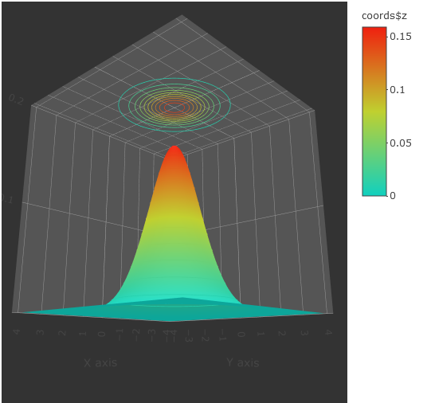

# Баесовский Классификатор

**Баесовский классификатор** - самый оптимальный аналитический классификатор, на основе плотности распределения классов. Проблема состоит в том что, мы не имеем этих плотностей - *неизвестный параметр*.

#### Линии уровня для баесовского классификатора на основе нормального распределения.

Проилюстрируем линии уровня для нормального распределения, имитирующего некий класс.

Величина рапределения в точке **x** считается по формуле:

**ND(x, u, M) = e^(-0.5 * (x - u)T * ~M * (x - u)) / sqrt((2 * pi)^k * |M|)**,

где *x* - наша точка размерности *k*, *u* - точка центра размерности *k*, *M* - ковариационная матрица, *~M* - обратная матрица, *(V)T* - транспонированый вектор *V*;

##### Граффик плотности одного класса с линиями уровня

> u = (0, 0)
> M = [[1, 0], [0, 1]]

["Интерактивный граффик, щелкните!"](countour.html)

##### Граффик плотности двух классов с линиями уровня

> u1 = (0.8, -1)
> M1 = [[2, 1], [0, 0.5]]
> u2 = (-1, 1.5)
> M2 = [[0.8, 0], [-1, 1.2]]

["Интерактивный граффик, щелкните!"](countour2.html)

## Баесовские алгоритмы

Рассмотреные ниже алгоритмы, так или иначе, находят именно **плотность распределения** класса на основе обучающей выборки.

#### Наивный баес
