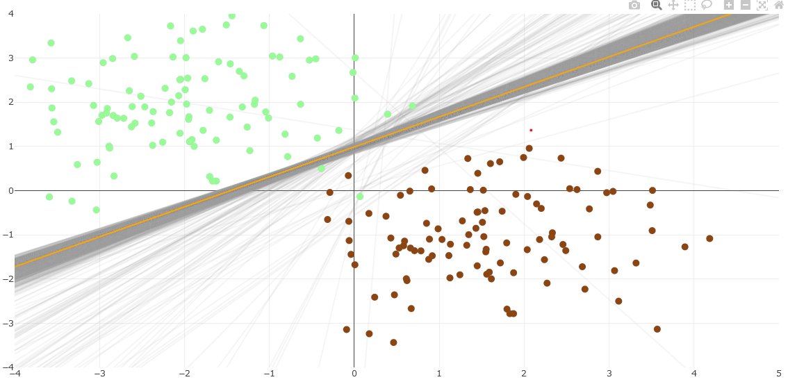
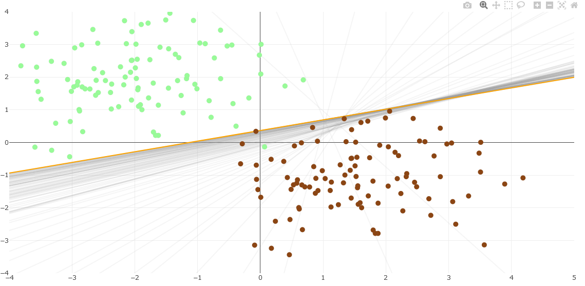
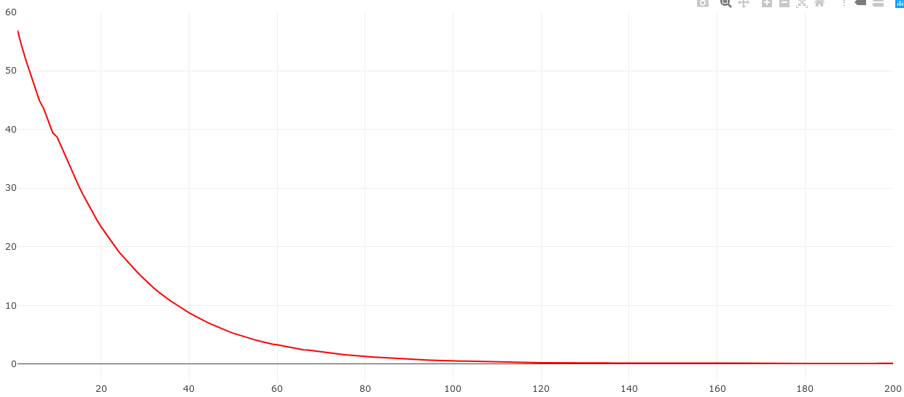
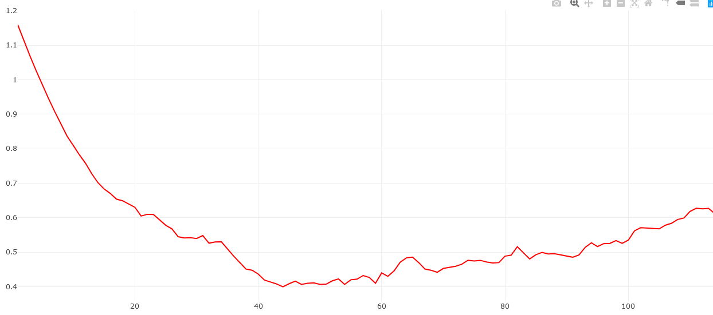

# Линейный Классификатор

**Линейный классификатор** - алгоритм классификации, который строит между классами разделяющую линейную поверхность, например прямую в двумерном пространстве и плоскость в трехмерном пространстве.
Часто это может быть *кусочно-линейная* поверхность, состоящая из нескольких ограниченных линейных поверхностей.

Общая формула для двух классов выглядит так:

`a(x) = sign( sum(j,1,n){ω_j * f_j(x)} - ω_0 )`

где, `(ω_0, ..., ω_n)` - параметры нашей разделяющей n-мерной линейной поверхности; `(f_1, ..., f_n)` - функции признака для обьекта выборки `x`, область значений в множестве вещественных чисел(не обязательно).


Также, для осуществеления обучения введем понятие **отступа M** - функция которая показывает знаковое растояние обьекта до построеной алгоритмом классификации поверхности.
*Суть знакового расстояния*, если граница лежит между обьектом класса и остальной массой обьектов того-же класс, значит такой обьект имеет оттрицательное расстояние - отрицательный **отступ.**
Чем больше отступ, тем сильнее обьект находится внутри своего класса.

Формула отступа для двумерного случая:

`M(ω) = y_i * f(x_i, ω)`

где, `y_i` - i-е значение класса в множестве `Y = {-1,+1}`; `f(x_i, ω)` - знакова функция растояния для точки `x_i` до поверхности `ω`;  `ω` - вектор параметров разделяющей поверхности.


Чтоб суметь оценить качество построеного классификатора введем понятие **эмпирического риска**. Он будет показывать насколько часто и сильно ошибается наш классификатор на обучающей выборке. В итоге обучение сводится к задаче **минимизации эмпирического риска**, тоесть подбор и корректировка такого классификатора чтоб эмпирический риск был наименьшим.

Функционал эмпирического риска:

`Q(a) = sum(i,1,m){ L(a(x_i), y_i) }`

где, `L(a(x_i), y_i)` - функция потерь, дающая оценку тому насколько отклонился результат работы класификатора `a` для обьекта выборки `x_i` от истиного ответа `y_i`.

(часто в составе *функции потерь* используют *отступ*)

**Содержание:**
1. [ADALINE и Правило Хэбба](#adaline-и-правило-хэбба)


## ADALINE и Правило Хэбба
[В начало](#линейный-классификатор)

### Метод стохастического градиента

**Метод стохастического градиента** - метод обучения, градиентный, при котором мы пошагово приближаем разделяющую поверхность к оптимальной. При чем, для получения оптимального приближения на каждом шаге мы выбираем лишь один из элементов выборки, случайным образом.

Итерационная формула:

`ω := ω - η*∇Q(ω)`

где, `ω` - вектор параметров разделяющей поверхности, `η` - коэффициент темпа обучения, `∇Q` - градиент нашего функционала эмпирического риска (`∇` - оператор набла).


Реализация для любой функции риска:

```R
stohastGrad <- function(dat, L, dL, etha = 1, lambda = 0.5, history = F){

  l <- dim(dat)[1]
  n <- dim(dat)[2] - 1

  omega <- runif(n, -0.5, 0.5)
  omegaHist <- matrix(c(omega), ncol = n)

  Q <- 0
  for(i in 1:l){
    x = dat[i,1:n]
    y = dat[i,n+1]
    Q <- Q + L(x, y, omega)
  }
  QHist <- c(Q)

  for(it in 1:1000){
    randIndex <- sample(1:l, 1)

    eps <- L(dat[randIndex, 1:n], dat[randIndex, n+1], omega)
    step <- etha*dL(dat[randIndex, 1:n], dat[randIndex, n+1], omega)/it
    newQ <- (1-lambda)*Q + lambda*eps

    print(c(it, omega, Q))
    if(all(abs(step) < 0.0005) || all(abs(Q - newQ) < 0.00001)){
      print("break")
      break
    }

    omega <- omega - step
    Q <- newQ

    if(history){
      QHist <- c(QHist, Q)
      omegaHist <- rbind(omegaHist, omega)
    }
  }

  return(list(omega=omega, omegaHist=omegaHist, QHist = QHist))
}
```

### ADALINE

Адалайн один из методов обучения стохастического градиента на основе *минимизации эмпирического риска*, использует в качестве *функции потерь* квадратичную: `L(x, y) = (M(ω) - y)^2`, при условии что, у нас `Y = {-1,+1}`, `M(ω) = y_i*dot(ω, x_i)`.

При такой функции потерь выходит итерационная формула: `ω := ω - η*2*(dot(ω, x_i) - y_i)*x_i`

```R
adaL <- function(xi, yi, omega){
  return((dot(omega, xi)*yi-1)^2)
}
adadL <- function(xi, yi, omega){
  return(2*(dot(omega, xi) - yi)*xi)
}
```

### Правило Хэбба

Правило Хебба(Персептрон Розенблатта) - также один из методов обучения стохастического градиента.
Само правило заключается в том что, мы меняем веса только тогда когда `M < 0`. И меняем их на величину `xi*yi`.

 В качестве *функции потерь* используется: `L(x, y) = (-M(ω), 0)`, при условии что, у нас `Y = {-1,+1}`, `M(ω) = y_i*dot(ω, x_i)`

 Итерационная формула: `ω := ω - η*y_i*x_i `

```R
hebbL <- function(xi, yi, omega){
  return(max(-dot(omega, xi)*yi, 0))
}
hebbdL <- function(xi, yi, omega){
  return(yi*xi)
}
```

#### Сравнение

|ADALINE|Hebb Rule|
| - | - |
|||
|||
